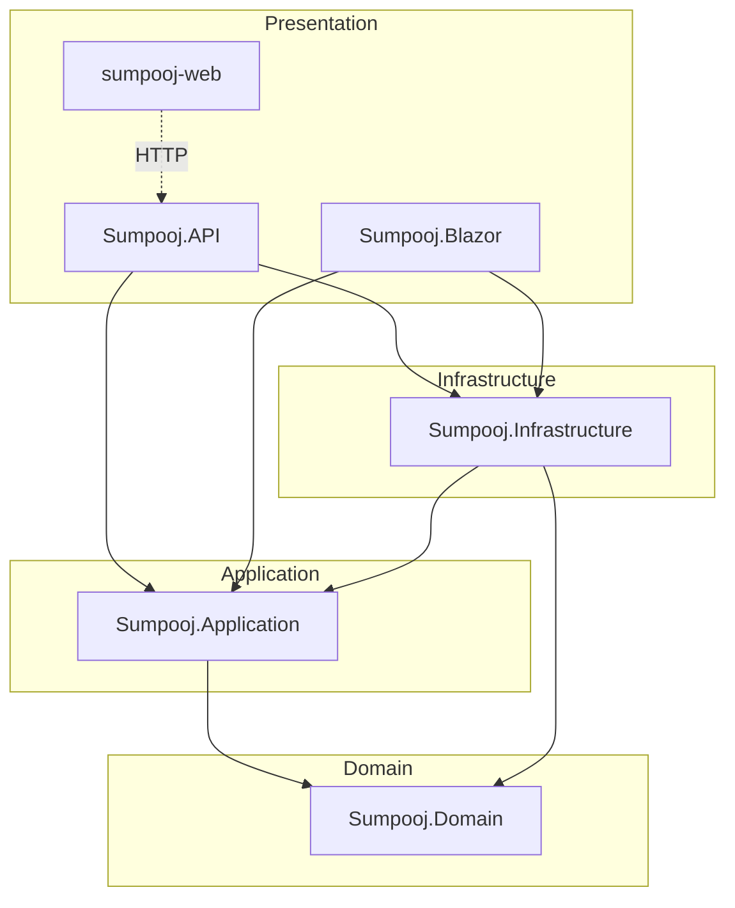
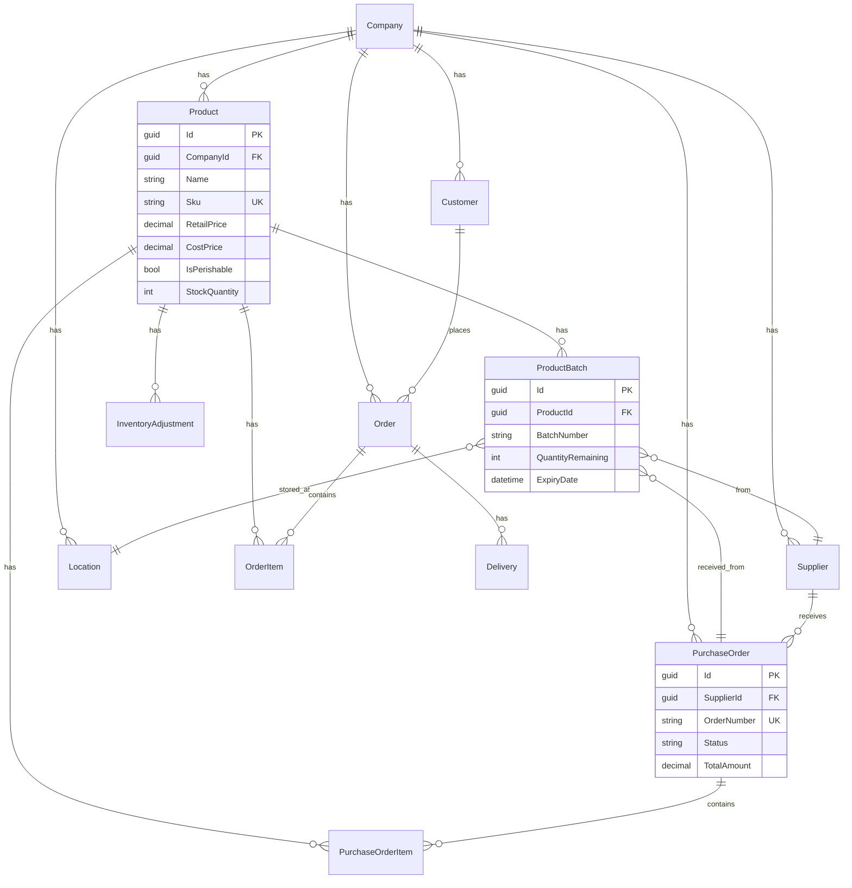
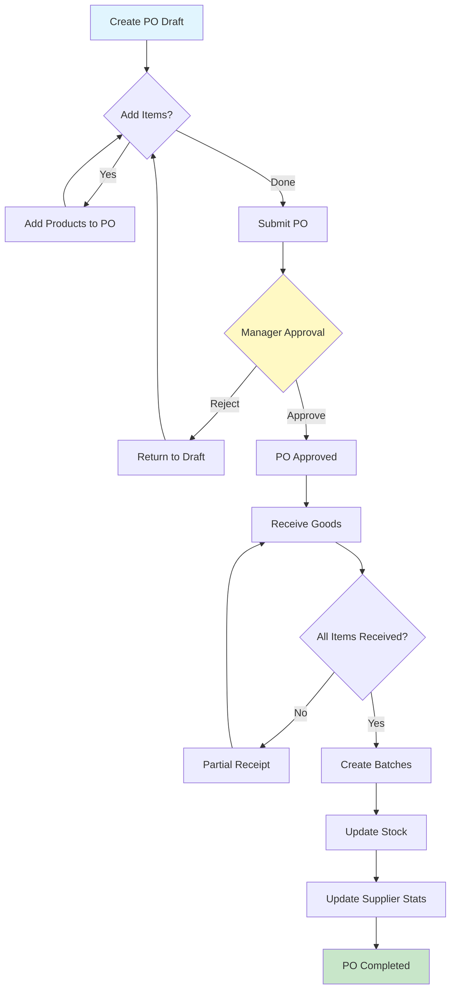
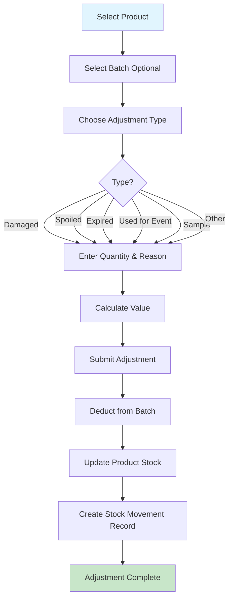
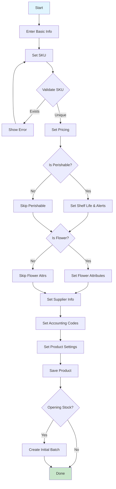
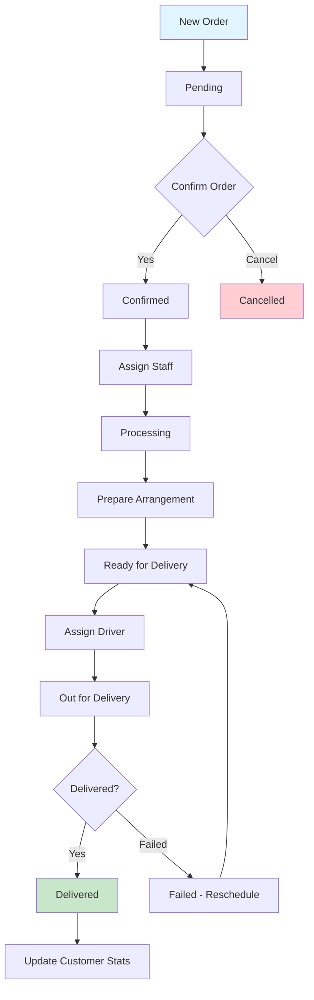
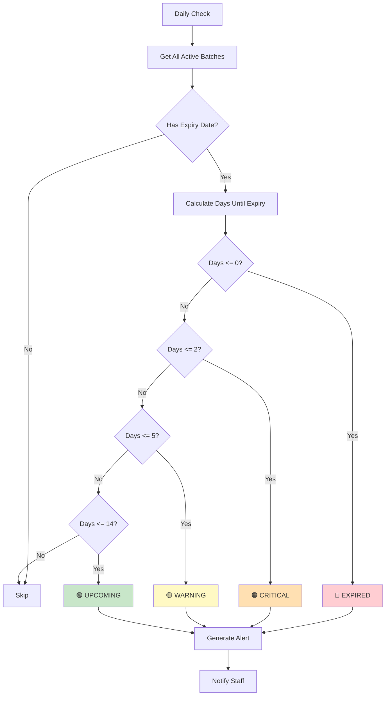

# 🌸 FloraEdge  - Florist ERP System

**Enterprise-level SaaS software for florist businesses**

A comprehensive ERP solution built with Clean Architecture, designed specifically for florist shops and flower businesses. Manage products, inventory, purchases, customers, orders, and deliveries - all in one platform.

[](https://dotnet.microsoft.com/)
[](https://www.postgresql.org/)
[](LICENSE)

---

## 📋 Table of Contents

- [Features](#-features)
- [Architecture](#-architecture)
- [Tech Stack](#-tech-stack)
- [Getting Started](#-getting-started)
- [API Endpoints](#-api-endpoints)
- [Database Schema](#-database-schema)
- [Flowcharts](#-flowcharts)
- [Project Structure](#-project-structure)

---

## ✨ Features

### 🛍️ Product Management
- **Product Catalog** - Manage flowers, plants, arrangements, gifts, and accessories
- **SKU Management** - Unique product identification with SKU validation
- **Multi-tier Pricing** - Retail, wholesale, and wedding/event pricing
- **Flower-specific Attributes** - Color, variety, grade, country of origin, seasonality
- **Perishable Tracking** - Shelf life, expiry alerts, temperature notes
- **Tax Categories** - Configurable tax rates per product

### 📦 Inventory Management
- **Batch Tracking** - FIFO inventory management with batch numbers
- **Multi-location Support** - Track stock across stores, warehouses, cold rooms
- **Expiry Management** - Automatic alerts for expiring products
- **Stock Adjustments** - Track damaged, spoiled, samples, theft, corrections
- **Low Stock Alerts** - Configurable reorder levels and minimum stock
- **Real-time Stock Levels** - Accurate inventory counts across locations

### 🛒 Purchase Order Management
- **Supplier Management** - Track suppliers, ratings, payment terms
- **PO Workflow** - Draft → Submit → Approve → Receive → Complete
- **Batch Creation on Receipt** - Automatic batch creation when receiving goods
- **Cost Tracking** - Track purchase costs and margins
- **Expected Delivery Dates** - Plan inventory arrivals

### 👥 Customer Relationship Management (CRM)
- **Customer Database** - Store customer information and preferences
- **Order History** - Track total orders per customer
- **Default Card Messages** - Save customer preferences
- **Soft Delete** - Deactivate customers without losing history

### 📝 Order Management
- **Order Processing** - Complete order lifecycle management
- **Delivery Scheduling** - Schedule and track deliveries
- **Payment Tracking** - Track payment status (unpaid, partial, paid)
- **Priority Levels** - Standard, express, same-day delivery options

### 🏢 Multi-Tenant Architecture
- **Company Isolation** - Complete data separation between tenants
- **Role-based Access** - Platform admin, company admin, manager, staff roles
- **Secure Authentication** - JWT-based authentication with refresh tokens

### 📍 Multi-Location Support
- **Location Types** - Store, warehouse, cold room, display cooler, dry storage
- **Default Location** - Set primary location for operations
- **Stock by Location** - Track inventory per location

---

## 🏗️ Architecture

### Clean Architecture Overview

```
┌─────────────────────────────────────────────────────────────────┐
│                        PRESENTATION                              │
│  ┌─────────────────┐  ┌─────────────────┐  ┌─────────────────┐  │
│  │   Sumpooj.API   │  │ Sumpooj.Blazor  │  │  sumpooj-web    │  │
│  │   (REST API)    │  │  (Server UI)    │  │   (React SPA)   │  │
│  └────────┬────────┘  └────────┬────────┘  └────────┬────────┘  │
└───────────┼─────────────────────┼─────────────────────┼─────────┘
            │                     │                     │
            ▼                     ▼                     ▼
┌─────────────────────────────────────────────────────────────────┐
│                        APPLICATION                               │
│  ┌─────────────────────────────────────────────────────────┐    │
│  │                 Sumpooj.Application                      │    │
│  │  • Use Cases (Services)    • DTOs                        │    │
│  │  • Interfaces              • Validation                  │    │
│  └─────────────────────────────────────────────────────────┘    │
└─────────────────────────────────────────────────────────────────┘
            │
            ▼
┌─────────────────────────────────────────────────────────────────┐
│                          DOMAIN                                  │
│  ┌─────────────────────────────────────────────────────────┐    │
│  │                   Sumpooj.Domain                         │    │
│  │  • Entities        • Enums         • Value Objects       │    │
│  │  • Business Rules  • Domain Events                       │    │
│  └─────────────────────────────────────────────────────────┘    │
└─────────────────────────────────────────────────────────────────┘
            │
            ▼
┌─────────────────────────────────────────────────────────────────┐
│                       INFRASTRUCTURE                             │
│  ┌─────────────────────────────────────────────────────────┐    │
│  │                Sumpooj.Infrastructure                    │    │
│  │  • Repositories    • DbContext     • Identity            │    │
│  │  • Configurations  • Migrations    • External Services   │    │
│  └─────────────────────────────────────────────────────────┘    │
└─────────────────────────────────────────────────────────────────┘
```

### Dependency Flow



---

## 🛠️ Tech Stack

| Layer | Technology |
|-------|------------|
| **Backend API** | .NET 10, ASP.NET Core Web API |
| **Frontend (Web)** | React, TypeScript, TailwindCSS |
| **Frontend (Admin)** | Blazor Server |
| **Database** | PostgreSQL |
| **ORM** | Entity Framework Core |
| **Authentication** | ASP.NET Identity + JWT |
| **API Documentation** | OpenAPI (Scalar) |
| **Architecture** | Clean Architecture, DDD |

---

## 🚀 Getting Started

### Prerequisites

- [.NET 10 SDK](https://dotnet.microsoft.com/download)
- [PostgreSQL](https://www.postgresql.org/download/)
- [Node.js](https://nodejs.org/) (for React frontend)

### Installation

1. **Clone the repository**
   ```bash
   git clone https://github.com/sumitkumarsingh88/FloristERP.git
   cd FloristERP
   ```

2. **Configure the database connection**
   
   Update `Sumpooj.API/appsettings.json`:
   ```json
   {
     "ConnectionStrings": {
       "Default": "Host=localhost;Database=sumpooj;Username=postgres;Password=yourpassword"
     }
   }
   ```

3. **Run database migrations**
   ```bash
   dotnet ef database update --project Sumpooj.Infrastructure --startup-project Sumpooj.API
   ```

4. **Run the API**
   ```bash
   cd Sumpooj.API
   dotnet run
   ```

5. **Run the React frontend** (optional)
   ```bash
   cd sumpooj-web
   npm install
   npm run dev
   ```

### Default URLs

| Service | URL |
|---------|-----|
| API | https://localhost:7001 |
| Swagger/Scalar | https://localhost:7001/scalar |
| Blazor | https://localhost:7002 |
| React | http://localhost:5173 |

---

## 📡 API Endpoints

### Products
| Method | Endpoint | Description |
|--------|----------|-------------|
| GET | `/api/products/search` | Search products with filters |
| GET | `/api/products/{id}` | Get product by ID |
| POST | `/api/products` | Create new product |
| PUT | `/api/products/{id}` | Update product |
| GET | `/api/products/validate-sku` | Validate SKU uniqueness |
| GET | `/api/products/low-stock` | Get low stock products |
| GET | `/api/products/reorder` | Get products needing reorder |

### Inventory
| Method | Endpoint | Description |
|--------|----------|-------------|
| GET | `/api/inventory/batches` | Search batches |
| GET | `/api/inventory/batches/{id}` | Get batch by ID |
| POST | `/api/inventory/batches` | Create new batch |
| GET | `/api/inventory/expiry-alerts` | Get expiring batches |
| GET | `/api/inventory/summary` | Get inventory summary |
| GET | `/api/inventory/adjustments` | Search adjustments |
| POST | `/api/inventory/adjustments` | Create adjustment |

### Suppliers
| Method | Endpoint | Description |
|--------|----------|-------------|
| GET | `/api/suppliers` | Get all active suppliers |
| GET | `/api/suppliers/search` | Search suppliers |
| GET | `/api/suppliers/{id}` | Get supplier by ID |
| POST | `/api/suppliers` | Create new supplier |
| PUT | `/api/suppliers/{id}` | Update supplier |

### Purchases
| Method | Endpoint | Description |
|--------|----------|-------------|
| GET | `/api/purchases/search` | Search purchase orders |
| GET | `/api/purchases/{id}` | Get PO by ID |
| POST | `/api/purchases` | Create new PO |
| POST | `/api/purchases/{id}/submit` | Submit PO for approval |
| POST | `/api/purchases/{id}/approve` | Approve PO |
| POST | `/api/purchases/{id}/receive` | Receive PO items |
| POST | `/api/purchases/{id}/cancel` | Cancel PO |

### Lookup Data
| Method | Endpoint | Description |
|--------|----------|-------------|
| GET | `/api/lookup/product-types` | Get product types |
| GET | `/api/lookup/product-categories` | Get categories |
| GET | `/api/lookup/units-of-measure` | Get units |
| GET | `/api/lookup/adjustment-types` | Get adjustment types |

---

## 🗄️ Database Schema

### Entity Relationship Diagram



---

## 📊 Flowcharts

### Purchase Order Workflow



### Inventory Adjustment Flow



### Product Creation Flow



### Order Processing Flow



### Expiry Alert System



---

## 📁 Project Structure

```
Sumpooj/
├── Sumpooj.Domain/                 # Domain Layer
│   └── Entities/
│       ├── BaseEntity.cs
│       ├── Product.cs
│       ├── ProductBatch.cs
│       ├── Customer.cs
│       ├── Order.cs
│       ├── PurchaseOrder.cs
│       ├── Supplier.cs
│       ├── Location.cs
│       ├── InventoryAdjustment.cs
│       ├── StockMovement.cs
│       ├── Delivery.cs
│       └── Enums.cs
│
├── Sumpooj.Application/            # Application Layer
│   ├── Common/
│   │   └── PagedResult.cs
│   ├── Interfaces/
│   │   ├── IProductRepository.cs
│   │   ├── ISupplierRepository.cs
│   │   ├── IInventoryRepositories.cs
│   │   └── ...
│   ├── Products/
│   │   ├── ProductDto.cs
│   │   └── ProductRequests.cs
│   ├── Inventory/
│   │   ├── InventoryDto.cs
│   │   └── InventoryRequests.cs
│   ├── Purchases/
│   │   ├── PurchaseOrderDto.cs
│   │   └── PurchaseOrderRequests.cs
│   └── UseCases/
│       ├── ProductService.cs
│       ├── SupplierService.cs
│       ├── InventoryService.cs
│       └── PurchaseOrderService.cs
│
├── Sumpooj.Infrastructure/         # Infrastructure Layer
│   ├── Persistence/
│   │   ├── SumpoojDbContext.cs
│   │   └── Configurations/
│   ├── Repositories/
│   │   ├── ProductRepository.cs
│   │   ├── SupplierRepository.cs
│   │   └── ...
│   ├── Identity/
│   │   └── ApplicationUser.cs
│   └── Migrations/
│
├── Sumpooj.API/                    # API Layer
│   ├── Controllers/
│   │   ├── ProductsController.cs
│   │   ├── SuppliersController.cs
│   │   ├── InventoryController.cs
│   │   ├── PurchasesController.cs
│   │   └── LookupController.cs
│   ├── Authorization/
│   └── Program.cs
│
├── Sumpooj.Blazor/                 # Blazor UI
│
└── sumpooj-web/                    # React Frontend
    └── src/
        ├── pages/
        │   ├── products/
        │   ├── inventory/
        │   ├── purchases/
        │   └── ...
        └── components/
```

---

## 🔐 Authorization

### Roles & Policies

| Policy | Roles | Description |
|--------|-------|-------------|
| `PlatformOnly` | PlatformSuperAdmin | Platform-wide operations |
| `PlatformSupport` | PlatformSuperAdmin, PlatformSupport | Support operations |
| `CompanyOnly` | Any authenticated company user | Company-scoped operations |
| `CompanyAdmin` | CompanyAdmin | Admin operations within company |
| `StaffAccess` | CompanyAdmin, Manager, Staff | Staff-level access |

---

## 📝 License

This project is licensed under the MIT License - see the [LICENSE](LICENSE) file for details.

---

## 👥 Contributors

- **Sumit Kumar Singh** - *Initial work* - [sumitkumarsingh88](https://github.com/sumitkumarsingh88)

---

## 🙏 Acknowledgments

- Clean Architecture principles by Robert C. Martin
- Domain-Driven Design concepts by Eric Evans
- ASP.NET Core team for the excellent framework

---

<p align="center">
  Made with ❤️ for florists everywhere
</p>
