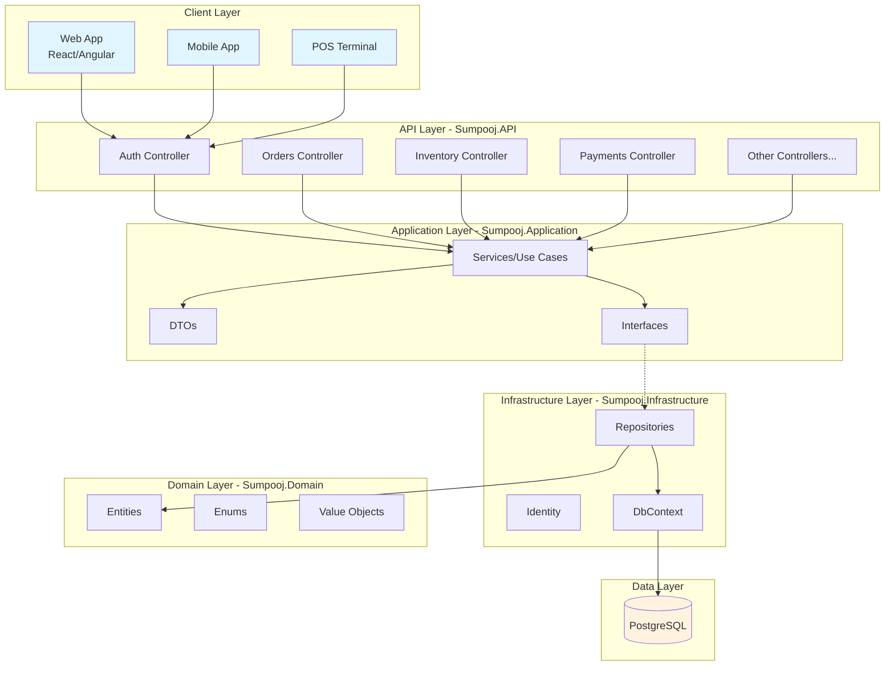
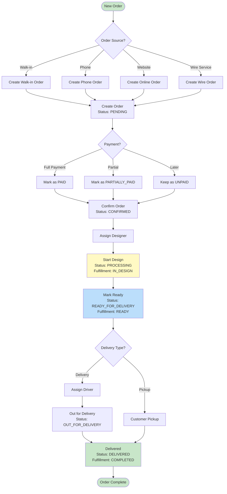
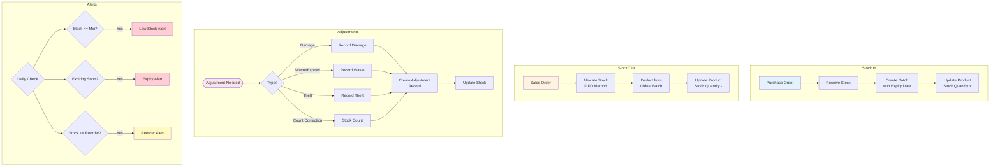
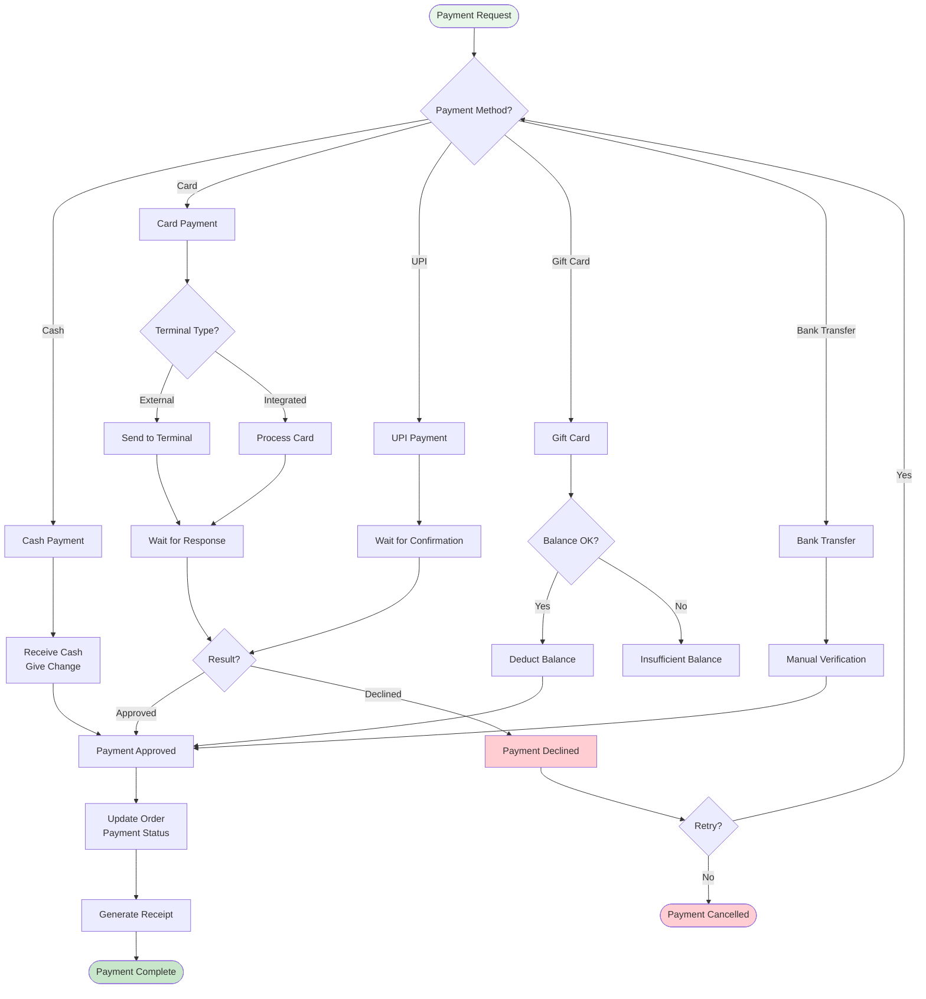
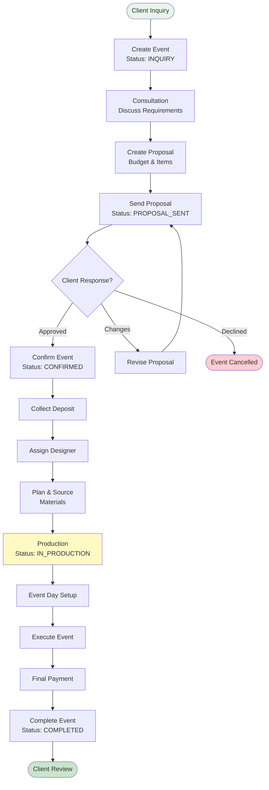
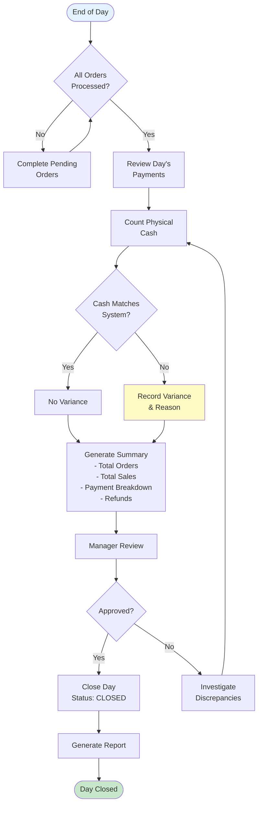
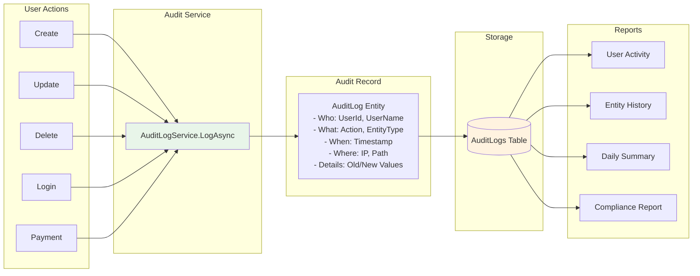
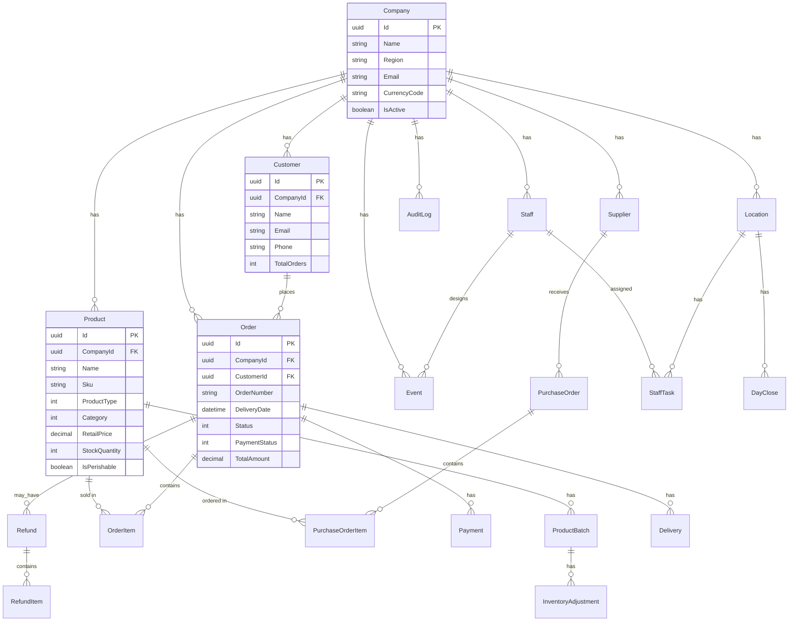
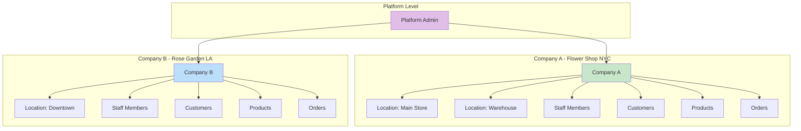

# Sumpooj Florist ERP

A comprehensive, multi-tenant Enterprise Resource Planning (ERP) system designed specifically for florist businesses. Built with .NET 10, Clean Architecture, and PostgreSQL.

## Overview

Sumpooj Florist ERP is a full-featured business management system tailored for florist shops, wedding planners, and event decorators. It handles everything from inventory management with perishable tracking to order processing, staff management, and financial operations.

### Key Highlights

- **Multi-Tenant Architecture**: Support multiple companies/stores with complete data isolation
- **Florist-Specific Features**: Flower grades, perishability tracking, batch expiry management
- **Complete Order Lifecycle**: From walk-in to delivery with real-time status tracking
- **Event Management**: Wedding and corporate event planning with budgets and timelines
- **Comprehensive Audit Trail**: Track every user action for compliance and debugging

---

## Features

### Core Business
- **Multi-Company**: Support multiple stores/franchises with isolated data
- **Locations**: Manage stores, warehouses, cold rooms, display areas
- **Staff Management**: Roles, commissions, task assignments
- **Customer CRM**: Customer profiles, order history, preferences

### Inventory Management
- **Product Catalog**: Flowers, arrangements, supplies, services
- **Batch Tracking**: FIFO-based inventory with expiry dates
- **Perishable Alerts**: Automated expiry notifications
- **Stock Adjustments**: Damage, waste, theft, corrections
- **Low Stock Alerts**: Reorder level notifications

### Order Processing
- **Multi-Source Orders**: Walk-in, phone, website, BloomNation, FTD
- **Delivery Management**: Time slots, driver assignments, proof of delivery
- **Fulfillment Tracking**: Draft to Design to Ready to Delivered
- **Card Messages**: Custom messages for recipients

### Financial Operations
- **Multiple Payment Methods**: Cash, card, UPI, gift cards, bank transfer
- **Terminal Integration**: External payment terminal support
- **Refund Processing**: Full/partial refunds with restock option
- **Day Close**: End-of-day cash reconciliation
- **Gift Cards**: Issue, redeem, track balances

### Event Management
- **Event Types**: Weddings, corporate, funerals, parties
- **Budget Tracking**: Proposals, costs, payments
- **Designer Assignment**: Assign staff to events
- **Mood Boards**: Color themes, style notes

### Analytics and Reporting
- **Dashboard**: Role-based metrics and KPIs
- **Audit Logs**: Complete user activity tracking
- **User Activity Reports**: Who did what and when

---

## Architecture

The solution follows **Clean Architecture** principles with 4 layers:

| Layer | Project | Responsibility |
|-------|---------|----------------|
| Domain | Sumpooj.Domain | Core business entities, enums, domain logic |
| Application | Sumpooj.Application | Use cases, DTOs, service interfaces |
| Infrastructure | Sumpooj.Infrastructure | Data access, EF Core, Identity |
| API | Sumpooj.API | HTTP endpoints, authentication |

### Architecture Diagram



---

## Business Process Flowcharts

### Order Processing Workflow



### Inventory Management Flow



### Payment Processing Flow



### Event Management Flow



### Day Close Process



### Audit Trail Flow



---

## Technology Stack

| Category | Technology |
|----------|------------|
| Framework | .NET 10 |
| Database | PostgreSQL 15+ |
| ORM | Entity Framework Core 10 |
| Authentication | ASP.NET Identity + JWT |
| API Documentation | OpenAPI (Scalar) |

---

## Getting Started

### Prerequisites
- .NET 10 SDK
- PostgreSQL 15+
- Visual Studio 2022 or VS Code

### Installation

1. Clone the repository
2. Create PostgreSQL database: `CREATE DATABASE FloristERP;`
3. Run schema: `psql -d FloristERP -f Database/sumpooj_complete_schema.sql`
4. Update connection string in `Sumpooj.API/appsettings.json`
5. Run: `cd Sumpooj.API && dotnet run`
6. Access API at https://localhost:5001

### Default Users

| Role | Email | Password |
|------|-------|----------|
| Platform Admin | sumit.singh@sumpooj.com | Admin@123 |
| Company Admin | admin@demoflorist.com | Admin@123 |

---

## Project Structure

| Project | Contents | Count |
|---------|----------|-------|
| Sumpooj.Domain | Entities, Enums | 17 entities |
| Sumpooj.Application | Services, DTOs, Interfaces | 15 services |
| Sumpooj.Infrastructure | DbContext, Repositories | 15 repositories |
| Sumpooj.API | Controllers | 19 controllers |
| Database | SQL Schema | 25 tables |

### Domain Entities
Company, Customer, Product, ProductBatch, Order, OrderItem, Staff, Event, Payment, Refund, RefundItem, GiftCard, DayClose, AuditLog, PurchaseOrder, Supplier, Location, Delivery, StaffTask, InventoryAdjustment, StockMovement

### Application Services
ProductService, OrderService, CustomerService, StaffService, EventService, PaymentService, RefundService, GiftCardService, TaskService, DayCloseService, DashboardService, AuditLogService, SupplierService, LocationService, InventoryService, PurchaseOrderService

### API Controllers
AuthController, CustomerController, ProductsController, OrdersController, PaymentsController, RefundsController, StaffController, EventsController, TasksController, GiftCardsController, DayCloseController, DashboardController, AuditLogsController, SuppliersController, LocationsController, InventoryController, PurchasesController, CompaniesController, LookupController

---

## API Endpoints

| Category | Base Path | Key Operations |
|----------|-----------|----------------|
| Auth | /api/auth | login, register, refresh |
| Customers | /api/customer | CRUD + search |
| Products | /api/products | CRUD + search, low-stock alerts |
| Inventory | /api/inventory | batches, adjustments, expiry-alerts |
| Orders | /api/orders | CRUD + status, fulfillment, assign |
| Payments | /api/payments | CRUD + approve, void |
| Refunds | /api/refunds | CRUD |
| Gift Cards | /api/gift-cards | issue, redeem, check-balance |
| Staff | /api/staff | CRUD + search |
| Events | /api/events | CRUD + upcoming |
| Tasks | /api/tasks | CRUD + start, complete |
| Dashboard | /api/dashboard | role-based metrics |
| Audit Logs | /api/audit-logs | search, summary, user-activity |
| Day Close | /api/day-close | summary, close, history |
| Companies | /api/companies | CRUD (platform only) |
| Locations | /api/locations | CRUD |
| Suppliers | /api/suppliers | CRUD |
| Purchases | /api/purchases | CRUD + submit, receive |
| Lookup | /api/lookup | enum references |

---

## Database Schema (25 Tables)

| Category | Tables |
|----------|--------|
| Identity | AspNetUsers, AspNetRoles, +5 related |
| Core | Companies, Locations, Customers, Staff, Suppliers |
| Products | Products, ProductBatches, InventoryAdjustments |
| Orders | Orders, OrderItems, Deliveries |
| Purchases | PurchaseOrders, PurchaseOrderItems |
| Finance | Payments, Refunds, RefundItems, GiftCards, DayCloses |
| Operations | Events, Tasks, StockMovements |
| Audit | AuditLogs |

### Entity Relationship Diagram



### Multi-Tenant Data Model



---

## Authorization Roles

| Role | Scope | Access |
|------|-------|--------|
| PlatformSuperAdmin | Platform | Full platform access |
| PlatformSupport | Platform | Support operations |
| CompanyAdmin | Company | Full company access |
| Manager | Company | Management operations |
| Staff | Company | Day-to-day operations |
| Delivery | Company | Delivery-related only |

---

## Configuration

Key settings in `appsettings.json`:
- `ConnectionStrings:Default` - PostgreSQL connection
- `Jwt:Key` - JWT signing key (min 32 chars)
- `Jwt:Issuer` - JWT issuer identifier
- `Cors:AllowedOrigins` - Frontend URLs

---

## Development

### Build and Run
```
dotnet build
cd Sumpooj.API && dotnet run
```

### Database Migrations
```
cd Sumpooj.Infrastructure
dotnet ef migrations add MigrationName -s ../Sumpooj.API
dotnet ef database update -s ../Sumpooj.API
```

---

## Roadmap

- [ ] Advanced Reporting and Analytics
- [ ] Mobile App (React Native)
- [ ] Stripe/Payment Gateway Integration
- [ ] Email and SMS Notifications
- [ ] QuickBooks Integration
- [ ] Wire Service Integration (FTD, Teleflora)
- [ ] Customer Portal
- [ ] Inventory Forecasting

---

## Author

**Sumit Kumar Singh** - [GitHub](https://github.com/sumitkumarsingh88)

---

Made with love for Florists
